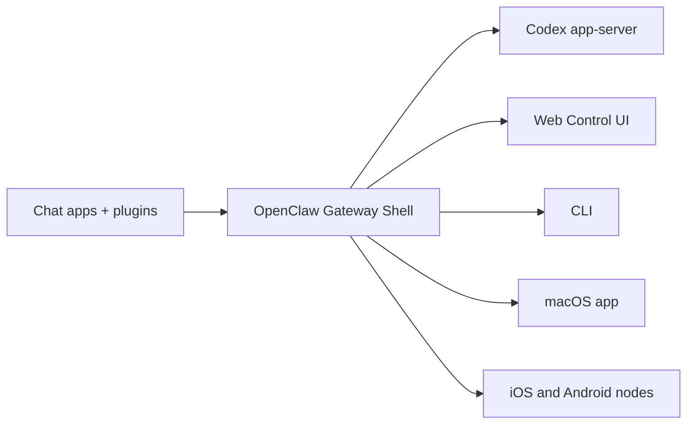

# OpenClaw 🦞

<p align="center">
    
    
</p>

> _"EXFOLIATE! EXFOLIATE!"_ — A space lobster, probably

<p align="center">
  <strong>Local-first gateway shell for Codex across WhatsApp, Telegram, Discord, iMessage, Slack, WebChat, and more.</strong><br />
  OpenClaw handles the channels, UI, sessions, approvals, and device integrations. Codex app-server handles the agent runtime.
</p>

<Columns>
  <Card title="Get Started" href="/start/getting-started" icon="rocket">
    Install OpenClaw and finish the one-click Codex bootstrap in minutes.
  </Card>
  <Card title="Manual Wizard" href="/start/wizard" icon="sparkles">
    Use the advanced/manual wizard when you want remote or custom setup.
  </Card>
  <Card title="Open the Control UI" href="/web/control-ui" icon="layout-dashboard">
    Launch the browser dashboard for chat, config, sessions, approvals, and tools.
  </Card>
</Columns>

## What is OpenClaw?

OpenClaw is a **self-hosted gateway shell** for AI assistants. In this fork, that shell is paired with **Codex app-server as the default and recommended brain**. You run one local or remote gateway, connect the channels you already use, and keep the control plane on infrastructure you trust.

**OpenClaw owns the shell:**

- Channels and routing
- Control UI, dashboard, and daemon lifecycle
- Session identity, projections, and gateway APIs
- Operator approvals, pairing, and safety controls
- Local integrations, nodes, browser control, and automation

**Codex owns the brain:**

- `gpt-5.4` by default in one-click setup
- Thread lifecycle and canonical history
- Planning, review, compaction, and approvals
- Skills, MCP/apps, sandboxed execution, and dynamic tools
- Rich item/event streaming during turns

## How it works



For Codex-backed sessions, **Codex thread state is canonical**. OpenClaw keeps the surrounding shell state, cached projections, routing, channel identity, and operator workflows.

## Key capabilities

<Columns>
  <Card title="Multi-channel gateway" icon="network">
    WhatsApp, Telegram, Discord, Slack, Signal, iMessage, BlueBubbles, WebChat, and more from one gateway.
  </Card>
  <Card title="Codex-native runtime" icon="cpu">
    Managed Codex app-server over stdio with approvals, compaction, review, skills, and thread APIs.
  </Card>
  <Card title="Operator control plane" icon="shield">
    Approval prompts, request-user-input flows, pairing, session controls, and policy surfaces stay in OpenClaw.
  </Card>
  <Card title="Web Control UI" icon="monitor">
    Browser dashboard for chat, config, session history, review output, and structured runtime events.
  </Card>
  <Card title="Skills + local tools" icon="wrench">
    OpenClaw-managed skills roots plus local browser, node, canvas, exec, and automation integrations.
  </Card>
  <Card title="Mobile + desktop nodes" icon="smartphone">
    Pair iOS, Android, and macOS nodes for camera, voice, screen, and device-local actions.
  </Card>
</Columns>

## Quick start

<Steps>
  <Step title="Install OpenClaw">
    ```bash
    npm install -g openclaw@latest
    ```
  </Step>
  <Step title="Run the one-click bootstrap">
    ```bash
    openclaw setup --one-click
    ```
  </Step>
  <Step title="Connect a channel or chat in the dashboard">
    ```bash
    openclaw channels login
    openclaw dashboard
    ```
  </Step>
</Steps>

The one-click path installs or upgrades a compatible Codex CLI, enables the app-server runtime surface, prepares skills directories, validates health, installs the gateway service, and opens the Control UI.

Need the full install and dev setup? See [Getting Started](/start/getting-started) and [Install](/install).

## Dashboard

Open the browser Control UI after the gateway starts.

- Local default: [http://127.0.0.1:18789/](http://127.0.0.1:18789/)
- Remote access: [Web surfaces](/web) and [Tailscale](/gateway/tailscale)

<p align="center">
  
</p>

## Configuration (optional)

Config lives at `~/.openclaw/openclaw.json`.

- If you do nothing, one-click setup writes a Codex-first local config with `gpt-5.4`, managed gateway auth, and a prepared workspace.
- If you want to lock down inbound access, start with per-channel `allowFrom`, `dmPolicy`, and mention rules.

Example:

```json5
{
  channels: {
    whatsapp: {
      allowFrom: ["+15555550123"],
      groups: { "*": { requireMention: true } },
    },
  },
  messages: { groupChat: { mentionPatterns: ["@openclaw"] } },
}
```

## Start here

<Columns>
  <Card title="Docs hubs" href="/start/hubs" icon="book-open">
    All docs and guides, organized by use case.
  </Card>
  <Card title="Configuration" href="/gateway/configuration" icon="settings">
    Core gateway settings, auth, sessions, sandboxing, and channels.
  </Card>
  <Card title="Remote access" href="/gateway/remote" icon="globe">
    SSH and tailnet access patterns.
  </Card>
  <Card title="Channels" href="/channels/telegram" icon="message-square">
    Channel-specific setup for WhatsApp, Telegram, Discord, Slack, and more.
  </Card>
  <Card title="Nodes" href="/nodes" icon="smartphone">
    iOS and Android nodes with pairing, Canvas, camera, and device actions.
  </Card>
  <Card title="Help" href="/help" icon="life-buoy">
    Common fixes and troubleshooting entry point.
  </Card>
</Columns>

## Learn more

<Columns>
  <Card title="Architecture" href="/concepts/architecture" icon="blocks">
    OpenClaw shell boundaries, Codex runtime boundary, and event flow.
  </Card>
  <Card title="Agent Runtime" href="/concepts/agent" icon="terminal">
    Codex app-server methods, skills, approvals, and thread lifecycle.
  </Card>
  <Card title="Multi-agent routing" href="/concepts/multi-agent" icon="route">
    Workspace isolation and per-agent sessions.
  </Card>
  <Card title="Security" href="/gateway/security" icon="shield">
    Tokens, allowlists, approvals, and safety controls.
  </Card>
  <Card title="Troubleshooting" href="/gateway/troubleshooting" icon="wrench">
    Gateway diagnostics and common runtime errors.
  </Card>
  <Card title="About and credits" href="/reference/credits" icon="info">
    Project origins, contributors, and license.
  </Card>
</Columns>
