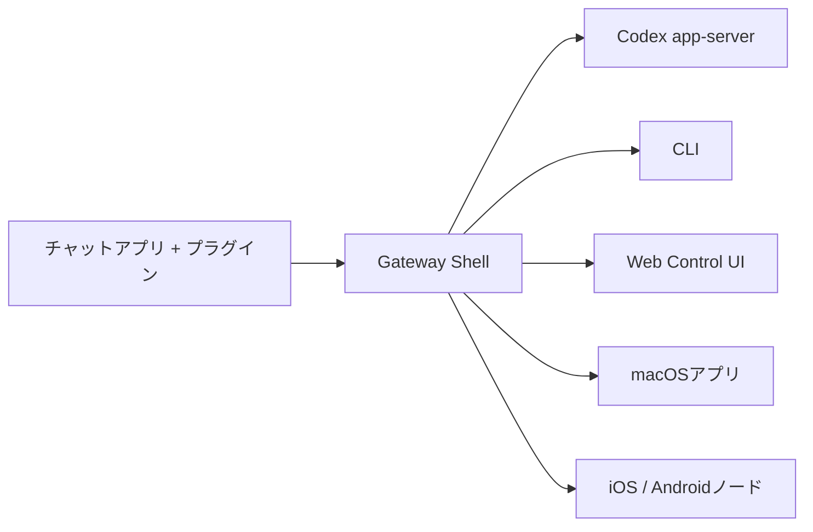

---
read_when:
  - 新規ユーザーにOpenClawを紹介するとき
summary: OpenClawはCodex app-serverの外側にあるローカルshellで、チャネル、UI、セッション、統合を担当します。
title: OpenClaw
x-i18n:
  generated_at: "2026-03-11T00:00:00Z"
  model: gpt-5
  provider: openai
  source_path: index.md
---

# OpenClaw 🦞

<p align="center">
    
    
</p>

> _「EXFOLIATE! EXFOLIATE!」_ — たぶん宇宙ロブスター

<p align="center">
  <strong>WhatsApp、Telegram、Discord、iMessageなどに対応したローカルGateway shell。</strong><br />
  OpenClawが外側の体験を担当し、Codex app-serverが内部ハーネスを担当します。
</p>

<Columns>
  <Card title="はじめに" href="/start/getting-started" icon="rocket">
    数分でCodexPlusClawを起動します。
  </Card>
  <Card title="ワンクリック設定" href="/cli/setup" icon="sparkles">
    `openclaw setup --one-click` が最速のローカル導線です。
  </Card>
  <Card title="Control UIを開く" href="/web/control-ui" icon="layout-dashboard">
    ブラウザでチャット、設定、セッションを操作します。
  </Card>
</Columns>

## OpenClawとは

OpenClawは**自分で運用するローカルshell**です。チャットアプリ、Control
UI、ペアリング、セッションID、デーモン、ローカル統合をまとめ、
**Codex app-server** が回復的なエージェント実行、skills、承認、review、
thread履歴、compactionを担当します。

## 仕組み



OpenClawは外側のプラットフォームを担当し、Codexは内部ハーネスを担当します。

## クイックスタート

```bash
npm install -g openclaw@latest
openclaw setup --one-click
```

手動またはリモートのウィザードが必要な場合は `openclaw onboard` を使います。
