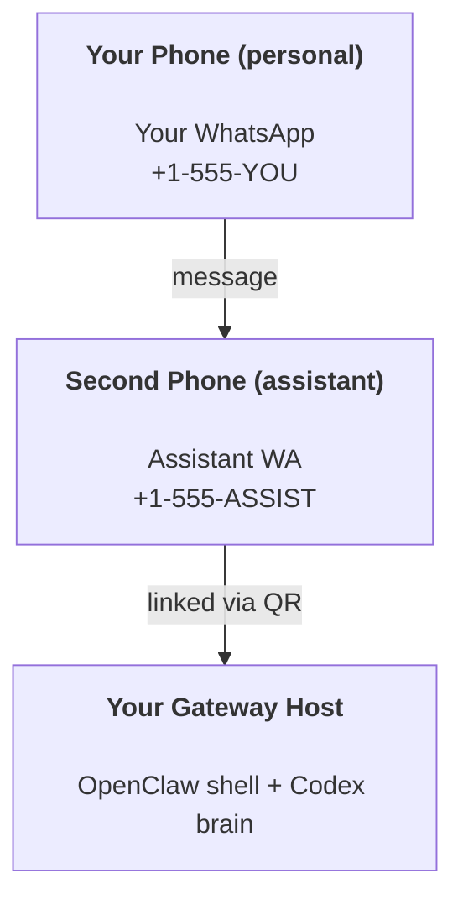

# Building a personal assistant with OpenClaw

OpenClaw is a WhatsApp + Telegram + Discord + iMessage + Web gateway shell for **Codex-powered assistants**. This guide is the personal-assistant setup: one dedicated chat identity that behaves like your always-on local-first assistant, while OpenClaw owns the channels, UI, sessions, and approvals.

## Safety first

You’re putting an agent in a position to:

- run commands on your machine through Codex approvals and sandbox policies
- read and write files in your workspace
- send messages back out through WhatsApp, Telegram, Discord, Slack, and other connected channels

Start conservative:

- Always set `channels.whatsapp.allowFrom` or the equivalent DM policy on the channels you enable.
- Use a dedicated WhatsApp number or bot identity for the assistant.
- Leave heartbeat off until you trust the setup, or keep the default cadence conservative.

## Prerequisites

- OpenClaw installed and bootstrapped
- Preferred path: [Getting Started](/start/getting-started)
- A second phone number or dedicated bot/account for the assistant, if you plan to use WhatsApp or similar personal channels

## The two-phone setup (recommended)

You want this:



If you link your personal WhatsApp to OpenClaw, every message to you becomes potential agent input. That is rarely what you want.

## 5-minute quick start

1. Run the local bootstrap:

```bash
openclaw setup --one-click
```

2. Pair WhatsApp Web if you want WhatsApp:

```bash
openclaw channels login
```

3. Put a minimal allowlist config in `~/.openclaw/openclaw.json`:

```json5
{
  channels: { whatsapp: { allowFrom: ["+15555550123"] } },
}
```

4. Open the dashboard:

```bash
openclaw dashboard
```

Now message the assistant account from your allowlisted phone.

## Give the agent a workspace

OpenClaw reads operating instructions and memory from its workspace directory.

By default, OpenClaw uses `~/.openclaw/workspace` and will create it with starter files automatically on setup. Workspace skills now live primarily in `~/.openclaw/workspace/.agents/skills`, with the older `skills/` path kept only as a compatibility alias.

```bash
openclaw setup
```

Full workspace layout: [Agent workspace](/concepts/agent-workspace)  
Memory workflow: [Memory](/concepts/memory)

## The config that turns it into an assistant

OpenClaw defaults to a good CodexPlusClaw local setup, but you will usually want to tune:

- persona and rules in `SOUL.md` / `AGENTS.md`
- per-channel access rules
- heartbeat and automation behavior

Example:

```json5
{
  logging: { level: "info" },
  agents: {
    defaults: {
      workspace: "~/.openclaw/workspace",
      codex: {
        defaultModel: "gpt-5.4",
        sandbox: "workspace-write",
        approvalPolicy: "on-request",
      },
      heartbeat: { every: "0m" },
    },
  },
  channels: {
    whatsapp: {
      allowFrom: ["+15555550123"],
      groups: {
        "*": { requireMention: true },
      },
    },
  },
  routing: {
    groupChat: {
      mentionPatterns: ["@openclaw", "openclaw"],
    },
  },
  session: {
    dmScope: "per-channel-peer",
    reset: {
      mode: "daily",
      atHour: 4,
      idleMinutes: 10080,
    },
  },
}
```

## Sessions and memory

- Session metadata: `~/.openclaw/agents/<agentId>/sessions/sessions.json`
- OpenClaw projections and cached transcript artifacts: `~/.openclaw/agents/<agentId>/sessions/`
- Codex thread state is the canonical conversation history for Codex-backed sessions
- `/new` or `/reset` starts a fresh session for that chat
- `/compact` requests Codex thread compaction for Codex-backed sessions

## Heartbeats

Heartbeats run full agent turns. Keep them conservative until you trust the assistant’s behavior.

```json5
{
  agents: {
    defaults: {
      heartbeat: { every: "30m" },
    },
  },
}
```

## Operations checklist

```bash
openclaw status
openclaw status --all
openclaw status --deep
openclaw health --json
openclaw logs --follow
```

## Next steps

- WebChat: [WebChat](/web/webchat)
- Gateway ops: [Gateway](/gateway)
- Cron + wakeups: [Cron jobs](/automation/cron-jobs)
- macOS companion: [OpenClaw macOS app](/platforms/macos)
- iOS node app: [iOS app](/platforms/ios)
- Android node app: [Android app](/platforms/android)
- Windows status: [Windows (WSL2)](/platforms/windows)
- Linux status: [Linux app](/platforms/linux)
- Security: [Security](/gateway/security)
