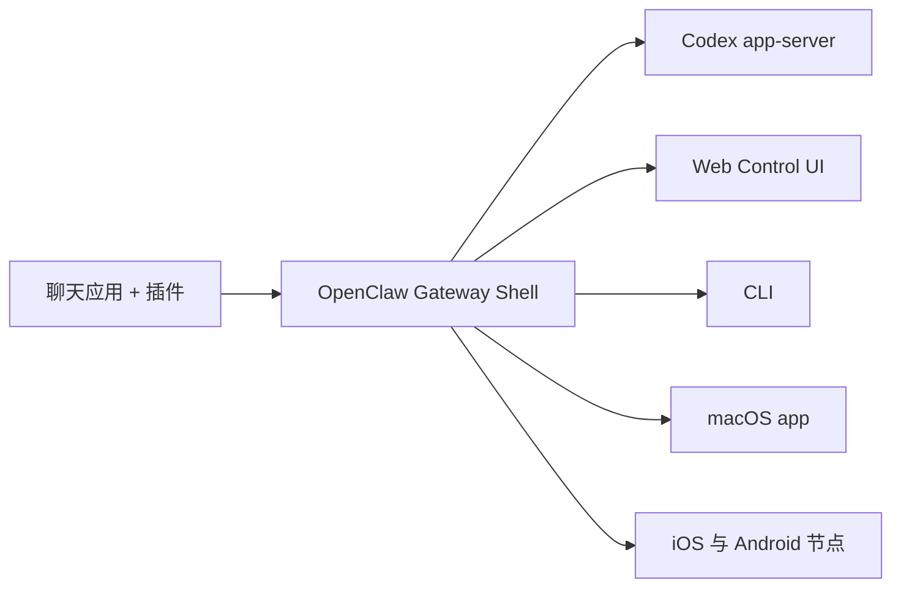

---
read_when:
  - 向新用户介绍 OpenClaw
summary: OpenClaw 是一个本地优先的多渠道 Gateway 外壳，默认以 Codex app-server 作为智能体大脑。
title: OpenClaw
---

# OpenClaw 🦞

<p align="center">
    
    
</p>

> _"去壳！去壳！"_ — 大概是一只太空龙虾说的

<p align="center">
  <strong>本地优先的 Codex Gateway 外壳，连接 WhatsApp、Telegram、Discord、iMessage、WebChat 等渠道。</strong><br />
  OpenClaw 负责渠道、UI、会话、审批和本地集成；Codex app-server 负责智能体运行时。
</p>

<Info>
本中文文档入口已更新到 CodexPlusClaw 架构。若某些深层中文页面仍滞后，请以英文文档为准。
</Info>

<Columns>
  <Card title="入门指南" href="/start/getting-started" icon="rocket">
    使用一键引导在几分钟内完成本地 OpenClaw + Codex 设置。
  </Card>
  <Card title="手动向导" href="/start/wizard" icon="sparkles">
    需要远程或高级配置时，使用手动向导。
  </Card>
  <Card title="打开控制界面" href="/web/control-ui" icon="layout-dashboard">
    启动浏览器控制台，管理聊天、配置、会话与审批。
  </Card>
</Columns>

## 它是什么

OpenClaw 是一个**自托管 Gateway 外壳**。在这个分支里：

- **OpenClaw 是外壳**：渠道、路由、Control UI、会话、审批、节点、本地工具、守护进程
- **Codex 是大脑**：线程生命周期、`gpt-5.4` 默认模型、规划、Review、Skills、压缩、审批流、结构化事件流

## 工作原理



## 快速开始

<Steps>
  <Step title="安装 OpenClaw">
    ```bash
    npm install -g openclaw@latest
    ```
  </Step>
  <Step title="运行一键引导">
    ```bash
    openclaw setup --one-click
    ```
  </Step>
  <Step title="连接渠道或直接在控制界面中聊天">
    ```bash
    openclaw channels login
    openclaw dashboard
    ```
  </Step>
</Steps>

## 继续阅读

<Columns>
  <Card title="架构" href="/concepts/architecture" icon="blocks">
    OpenClaw 外壳与 Codex 运行时边界。
  </Card>
  <Card title="智能体运行时" href="/concepts/agent" icon="terminal">
    Codex app-server 方法、Skills、审批和线程生命周期。
  </Card>
  <Card title="安全" href="/gateway/security" icon="shield">
    令牌、白名单、审批和安全控制。
  </Card>
  <Card title="帮助" href="/help" icon="life-buoy">
    常见问题与故障排除入口。
  </Card>
</Columns>
